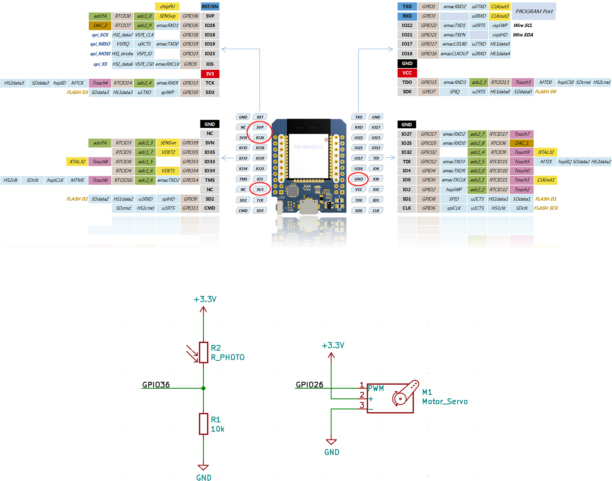

# T-Rex_run

Teaching unicorn new tricks and helping T-Rex jump. Based on the [unicorn CTF hardware](https://github.com/oliverhanka/UnicornPCB).

## Configuration
These values need to be adjusted in main.c:

| DEFINE | meaning |
| -------- | -------- |
| THRESHOLD     | ADV value which triggers t-rex to jump.      |
| SERVO_REST_POSITION     | servo position when not pressing space bar      |
| SERVO_PUSH_POSITION     | servo position when pressing space bar      |
| JUMP_DELAY     | delay between detecting an obstacle and making t-rex jump      |

These values should be fine, but can be tampered with as well.

| DEFINE | meaning |
| -------- | -------- |
| CHANNEL     | GPIO pin for the photo resistor      |
| SERVO_GPIO     | servo GPIO pin      |
| SERVO_PUSH_CNT     | time it takes for the servo to reach the push position      |
| SERVO_REST_CNT     | time it takes for the servo to reach the rest position      |
| DEBUG_CNT     | how often to print the debug message     |

## External components

